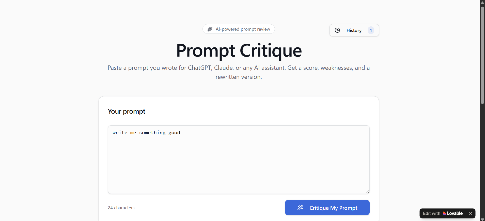
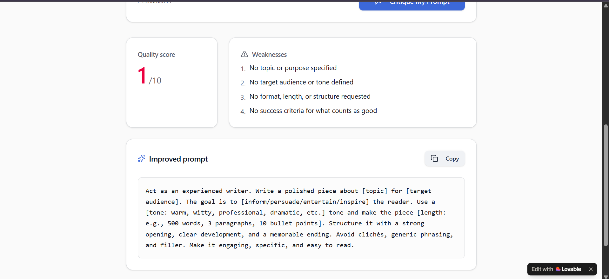
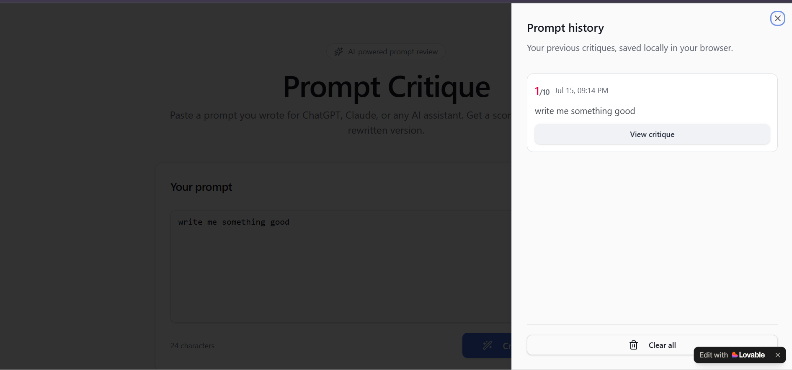
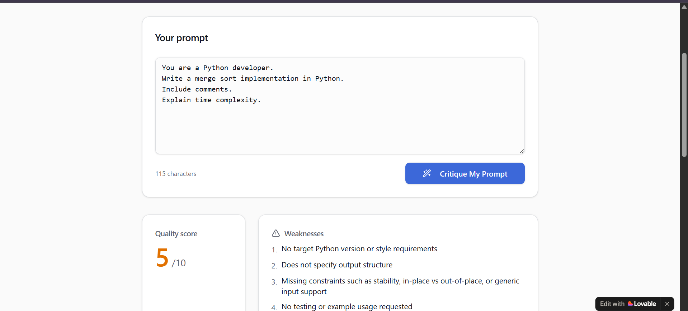
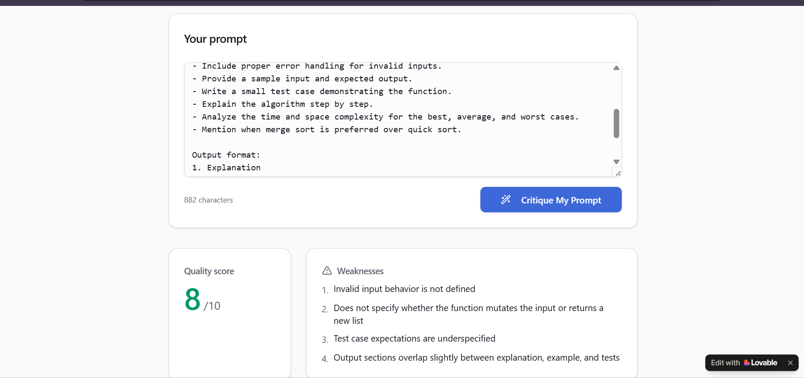

# 🎯 Prompt Critique

**An AI tool that critiques your prompts — so your prompts can get better results out of AI.**

[Live Demo](#) · [Built with Lovable](https://promptcritique.lovable.app)

---

## The Idea

Every "AI Builder" role today assumes one skill nobody actually teaches you: **how to write a good prompt.**

Most people, including experienced developers, write prompts like *"write me something good"* — vague, no context, no format, no success criteria — and then wonder why the AI's output feels generic. I wanted to build something that closes that gap directly: an AI that looks at *your* prompt, tells you exactly what's weak about it, and hands you back a stronger version you can actually use.

So I built **Prompt Critique** — a tool that treats prompt engineering itself as the product.

## What It Does

1. **Paste a prompt** — anything you'd normally send to ChatGPT, Claude, or another AI assistant
2. **Get a quality score** out of 10
3. **See specific weaknesses** — not generic feedback, but concrete gaps like *"no target audience defined"* or *"no success criteria for what counts as good"*
4. **Get a rewritten, improved version** of your own prompt, ready to copy and use immediately

### Example

**Input:** `write me something good`

**Output:**
- **Score:** 1/10
- **Weaknesses:** No topic or purpose specified · No target audience or tone defined · No format, length, or structure requested · No success criteria for what counts as good
- **Improved prompt:** A fully restructured version specifying role, topic, audience, tone, length, structure, and constraints — turning a 4-word throwaway line into a prompt that would actually produce a usable result.

## Screenshots

**The input screen** — paste any prompt and get an instant quality check.

**Score, weaknesses, and rewritten prompt** — specific, actionable feedback instead of a vague rating.

**Prompt history** — every critique is saved locally, so you can track how your prompts improve over time.

**Medium quality prompt (5/10)** — a short, underspecified prompt is scored lower and the tool lists exactly what's missing (target version, output structure, constraints, testing).

**Good quality prompt (8/10)** — a detailed, well-scoped prompt still gets pinpointed feedback on the small gaps left (e.g., undefined behavior for invalid input, unclear mutation semantics).

## Why This Project

I built this while preparing for an "AI Builder" role interview — one that specifically asked for hands-on experience with tools like Cursor, Claude, ChatGPT, and Lovable. Rather than just listing those tools on a resume, I wanted to build something that *proves* I understand what makes AI tools actually useful: not just calling an API, but understanding prompt design well enough to build a tool that teaches it.

It's a little meta — an AI tool for improving how you talk to AI tools — but that's the point. Good "AI Builders" don't just wire up API calls; they understand the craft underneath them.

## How It's Built

- **Frontend & app logic:** Built end-to-end in [Lovable](https://promptcritique.lovable.app), from initial prompt-to-app generation through UI refinement (dark → light theme, spacing, copy button, prompt history panel)
- **AI backend:** Connected to an LLM API that receives the user's prompt and returns a structured critique — score, weaknesses, and rewrite — parsed into a clean card-based UI
- **History:** Local browser storage keeps a record of past critiques so users can revisit earlier prompts and scores

## What I'd Build Next

- **Multiple critique modes** — e.g., a stricter mode for technical/coding prompts vs. a creative-writing mode
- **Improvement rubric** — a visible breakdown of *why* each weakness matters, not just that it exists
- **Prompt history comparison** — track how a user's prompt quality improves over multiple iterations

## Tech Stack

`Lovable` `LLM API (OpenAI/Gemini)` `Prompt Engineering` `Rapid Prototyping`

---

Built by [Habiba Tariq](https://habibatariq24.github.io/) · Lahore, Pakistan · 2026
